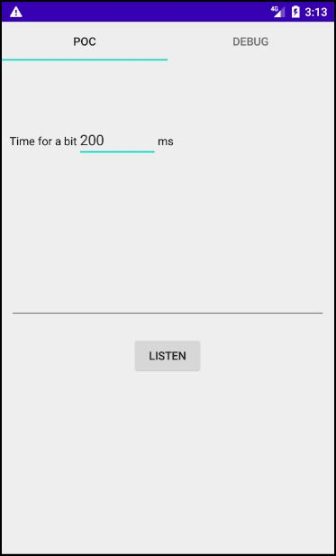

# Sink1 Android App

## Direct download
You can download apk file [here](https://drive.google.com/file/d/1JjlzPnidPJx4fq1V6DFDes_CNfx_zWjq/view?usp=sharing).

## Correct usage
In the *Debug* fragment, you can extract several system parameters. The application stores the main system parameters and export them in a *csv* file.

In the *PoC* fragment, you can set the time duration expected to retrieve a bit. The stream of chars will automatically show you.

**Warning**: touch to *Listen* button before to launch the sender bitstream.

## Screens
