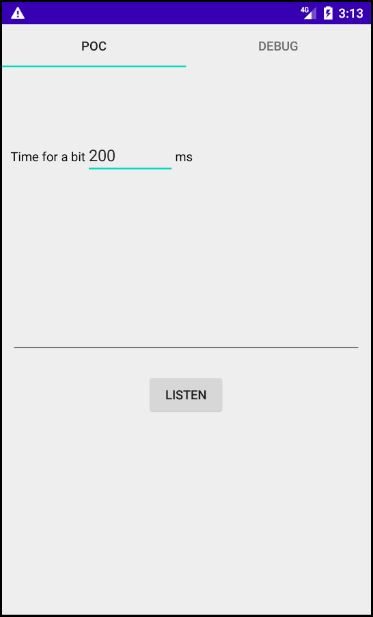

# Sink1 Android App

## Direct download
You can download apk file [here](https://drive.google.com/file/d/1HgLtTNjgqLGXvzI6K4-nLTA_qXaLllqe/view?usp=sharing).

## Correct usage
In the *Debug* fragment, you can extract the CPU workloads and the number of forwards computing into 10ms. The application stores the parameters and export them in a *csv* file.

In the *PoC* fragment, you can set the time duration expected to retrieve a bit. The stream of chars will automatically show you.

## Screens
