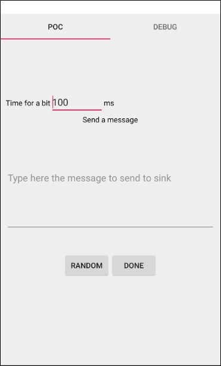

# Speech Command Android App with PyTorch

## Direct download
You can download apk file [here](https://drive.google.com/file/d/1GgHIV7YKy4ePQDHV_w4PaedIZvmfVAGN/view?usp=sharing).

## Manual building

You have the possibility to open the project with Android Studio.
In order to add **pt** files you have to add them in a new Asset directory.
The imported models are named in ``LOW_MODEL`` and ``HIGH_MODEL`` constants in ``ModuleForwarder.java``.

## Correct usage
In *Debug* fragment, it's possible to try the recognition networks. The application recognizes only some voice commands.

Only 'yes', 'no', 'up', 'down', 'left', 'right', 'on', 'off', 'stop' and 'go' are correctly recognized. All other classes are used as 'unknown' samples.
Furthermore, also the 'silence' audio is good. 

In *PoC* fragment, you can establish the duration time to send a single bit. Furthermore, you can type the message to transmit over the covert channel.

## Screens
